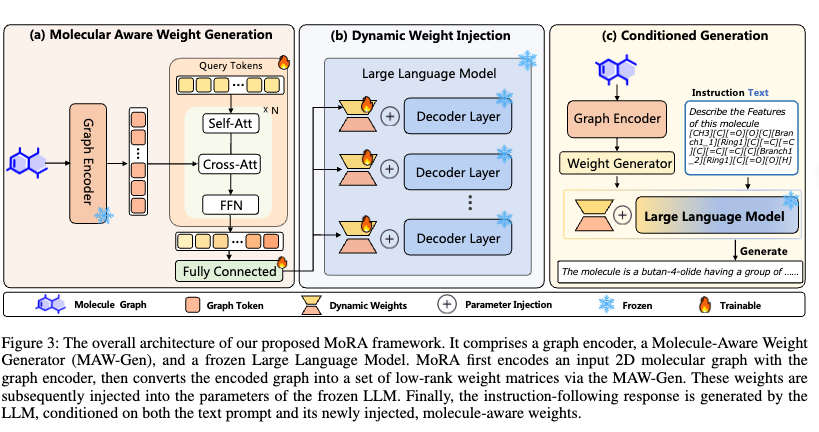

# MoRA: On-the-fly Molecule-aware Low-Rank Adaptation Framework for LLM-based Multi-Modal Molecular Assistant

<div align="center">
  
</div>

## 📖 Overview

MoRA (Molecule-aware Low-Rank Adaptation) is an innovative multi-modal molecular assistant framework specifically designed for handling molecule-related tasks. 

### 🌟 Key Features

- **Dynamic Weight Generation**: Dynamically generates mora adaptation weights based on molecular graph structures, enabling molecule-aware model adaptation
- **Multi-modal Fusion**: Seamlessly integrates text and molecular graph information, supporting complex molecule-text interaction tasks
- **Multi-task Support**: Supports various molecule-related tasks including molecular description generation, property prediction, reaction prediction, etc.
- **Scalable Architecture**: Modular design that is easily extensible to new molecular tasks and datasets
- **Frozen LLM**: Freezes LLM parameters and only trains MoRA adaptation layers

## 🏗️ Architecture Design

### Core Innovations

- **On-the-fly Weight Generation**: Unlike traditional static mora weights, MoRA dynamically generates adaptation weights based on input molecules
- **Molecule-aware Adaptation**: The weight generation process fully considers molecular structural information, achieving true molecule awareness
- **Hierarchical Weight Control**: Supports applying different adaptation strategies at different Transformer layers

## 🚀 Quick Start

### Pretrained graph encoder

We utilized the pre-trained graph encoder checkpoint from the paper of "MoleculeSTM: Multi-modal Molecule Structure-text Model for Text-based Editing and Retrieval". You can download the pre-trained graph encoder checkpoint from GitHub. Place the pretrained graph model in the `MoleculeSTM/' folder.

### Datasets

You can download the datasets from the paper of "Mol-Instructions: A Large-Scale Biomolecular Instruction Dataset for Large Language Models". Place both datasets (MoleculeDesc, instruction_tuning) in the `data/` folder.

### Requirements

- Python 3.8+
- PyTorch 1.12+
- CUDA 11.0+ (recommended)

### Install Dependencies

```bash
pip install -r requirements.txt
```

### Model Training

#### 1. Molecular Description Generation (MolCap)

```bash
bash scripts/finetune_mora_molcap.sh
```

#### 2. Molecular Property Prediction

```bash
bash scripts/finetune_mora_property_pred.sh
```

#### 3. Forward Reaction Prediction

```bash
bash scripts/finetune_mora_forward_pred.sh
```

#### 4. Reagent Prediction

```bash
bash scripts/finetune_mora_reagent_pred.sh
```

#### 5. Retrosynthesis Prediction

```bash
bash scripts/finetune_mora_retrosynthesis.sh
```

### Model Evaluation

#### Molecular Description Generation Evaluation

```bash
bash scripts/eval/molcap.sh
```

#### Other Task Evaluations

```bash
# Property prediction
bash scripts/eval/molcap_property.sh

# Forward reaction prediction  
bash scripts/eval/molcap_forward.sh

# Reagent prediction
bash scripts/eval/molcap_reagent.sh

# Retrosynthesis prediction
bash scripts/eval/molcap_retro.sh
```

## 📊 Supported Tasks

### 1. Molecular Description Generation (Molecular Captioning)
- Input: Molecular SMILES structure
- Output: Natural language description
- Evaluation metrics: BLEU, METEOR, ROUGE

### 2. Molecular Property Prediction
- Input: Molecular structure + property query
- Output: Predicted molecular property values
- Supported properties: Solubility, toxicity, bioactivity, etc.

### 3. Reaction Prediction
- **Forward Prediction**: Reactants → Products
- **Retrosynthesis Prediction**: Products → Reactants
- **Reagent Prediction**: Reactants + Products → Catalysts/Reagents

### 4. Molecular Question Answering (Molecular QA)
- Question answering tasks based on molecular structures
- Supports complex molecule-related reasoning

## 🔧 Configuration

### Model Configuration Parameters

```python
# MoRA core parameters
mora_dim: 512              # Hidden dimension of weight generator
mora_depth: 2              # Number of layers in weight generator
mora_visual_dim: 768       # Molecular feature dimension
mora_pos_num: 256          # Number of positional encodings
mora_llm_dim: 4096         # LLM hidden dimension
mora_llm_depth: 32         # Number of LLM layers
mora_rank: 64              # MoRA rank
mora_type: "qkvom"         # Attention components to adapt
mora_alpha: 64             # MoRA scaling factor
weights_sep: True          # Whether to separate weight generation
skip_layers: 1             # Number of layers to skip
```
